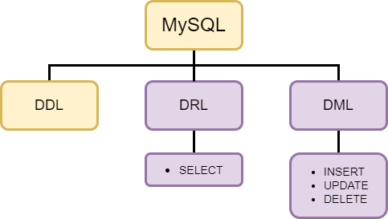
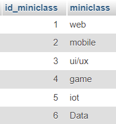
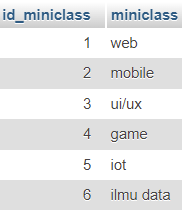

# DRL & DML

## 1. Permasalahan

Pada sebuah website, biasanya terdapat fitur untuk melakukan operasi CRUD (Create, Read, Update, dan Delete) seperti fitur edit biodata, menampilkan biodata, pencarian, dsb. Dalam database kita dapat menggunakan operasi DML & DRL untuk mengatasi permasalahan tersebut.

## 2. Penjalasan DML & DRL

### 2.1 DRL

DRL(Data Retrieval Language) adalah perintah SQL untuk mengambil data dari tabel database. DRL terdiri dari beberapa klausa yang dapat dikembangkan lagi, antara lain:
- FROM : Merujuk nama sebuah tabel yang akan dioperasikan. 
- WHERE : Memfilter row/baris yang akan dioperasikan dengan kondisi tertentu.
- ORDER BY : Mengurutkan record secara ASCENDING / DESCENDING.
- AS : Memberikan nama alias sementara untuk tabel atau kolom.

```sql
# Mengambil semua kolom dan semua baris
SELECT * FROM [nama_tabel] 

# Mengambil semua kolom pada baris tertentu
SELECT * FROM [nama_tabel] WHERE [kondisi]

# Mengambil kolom tertentu
SELECT [nama_kolom1, nama_kolom2, ...] FROM [nama_tabel] 

# Penggunaan ORDER BY
SELECT [nama_kolom1, nama_kolom2, ...] FROM [nama_tabel]
ORDER BY nama_kolom_filter ASC|DESC

# Penggunaan AS
SELECT [nama_kolom1 AS alias1, nama_kolom2 AS alias2, ...] FROM [nama_tabel] AS alias_tabel
```

### 2.2 DML

DML(Data Manipulation Language) adalah perintah SQL untuk melakukan manipulasi data dalam tabel. Manipulasi yang dimaksud disini adalah menambah data, mengupdate data, dan menghapus data.

- INSERT 

    Insert adalah sebuah operasi yang ada pada SQL untuk menambahkan baris baru pada sebuah tabel. 

    Klausa pembentuk :
    - INSERT
    - INTO
    - VALUES

    Format penulisan :
    ```sql
    # Tidak menyebutkan nama kolom secara spesifik (semua kolom)
    INSERT INTO [nama_tabel] 
    VALUES (value_kolom1, value_kolom2, ...)

    # Menyebutkan nama kolom secara spesifik
    INSERT INTO [nama_tabel] (nama_kolom1, nama_kolom2, ...) 
    VALUES (value_kolom1, value_kolom2, ...) 

    # Memasukkan banyak baris sekaligus
    INSERT INTO [nama_tabel] (nama_kolom1, nama_kolom2, ...) 
    VALUES ((value1_kolom1, value1_kolom2, ...),(value2_kolom1, value2_kolom2, ...))
    ```

- UPDATE

    Update adalah sebuah operasi yang ada pada SQL untuk mengubah nilai suatu baris pada sebuah tabel.

    Klausa pembentuk :
    - UPDATE
    - SET
    - WHERE [Opsional]

    Format penulisan :
    ```sql
    # Mengubah semua baris
    UPDATE [nama_tabel] SET [nama_kolom1] = [nilai1], [nama_kolom2] = [nilai2], ...

    # Mengubah baris tertentu
    UPDATE [nama_tabel] SET [nama_kolom1] = [nilai1], [nama_kolom2] = [nilai2], ... 
    WHERE [kondisi] 
    ```


- DELETE

    Delete adalah sebuah operasi yang ada pada SQL untuk menghapus suatu baris dari sebuah tabel.

    Klausa pembentuk :
    - DELETE
    - FROM
    - WHERE [Opsional]

    Format penulisan :

    ```sql
    # Menghapus semua baris
    DELETE FROM [nama_tabel] 

    # Menghapus baris tertentu
    DELETE FROM [nama_tabel] 
    WHERE [kondisi]
    ```

## 3. Contoh Kasus
Terdapat dua table yang bernama anggota dan miniclass pada database wri. Kedua table tersebut saling berelasi, yaitu sebagai berikut


Dari kedua table tersebut, kolom miniclass yang ada pada table anggota merupakan sebuah foreign key dari primary ket id_miniclass yang ada pada table miniclass. 

- Isi dari table miniclass

    

- Isi dari table anggota

    

### 3.1 DRL
- Mengambil record semua kolom dari tabel miniclass
    ```sql
    SELECT * FROM miniclass 
    ```

    HASIL QUERY:

    

- Mengambil semua kolom pada baris dengan id_miniclass adalah 1
    ```sql
    SELECT * FROM miniclass 
    WHERE id_miniclass = 1
    ```

    HASIL QUERY

    

- Mengambil kolom miniclass pada table miniclass
    ```sql
    SELECT miniclass 
    FROM miniclass
    ```

    HASIL QUERY

    

- Mengurutkan berdasarkan indeks paling besar (DESC)
    ```sql
    SELECT *
    FROM miniclass 
    ORDER BY miniclass.id_miniclass DESC
    ```

    HASIL QUERY

    

- Penggunaan AS
    ```sql
    SELECT *
    FROM miniclass AS m
    WHERE m.id_miniclass = 2
    ```

    HASIL QUERY

    

### 3.2 DML

- ### INSERT

    Data Awal

    

    ```sql
    # INSERT
    INSERT INTO miniclass(miniclass)
    VALUES (
        "Data"
    )
    # Query di atas adalah untuk memasukkan data baru ke kolom miniclass pada table miniclass
    ```

    Hasil Query Setelah Dilakukan SELECT

    

- ### UPDATE

    ```sql
    # Mengubah baris tertentu
    UPDATE miniclass 
    SET miniclass = 'ilmu data'
    WHERE miniclass = 'Data'
    ```

    Hasil Query Setelah Dilakukan SELECT

    

- ### DELETE

    ```sql
    # Menghapus record dengan id_miniclass adalah 6
    DELETE 
    FROM miniclass
    WHERE id_miniclass = 6
    ```

    HASIL QUERY SETELAH DILAKUKAN SELECT

    