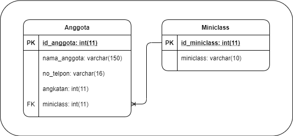

# DDL (Data Definition Language)

## 1. Permasalahan

setelah kita merancang sebuah ERD, langkah selanjutnya yaitu mengimplementasikannya ke dalam database. dengan menggunakan salah satu bentuk SQL yaitu menggunakan DDL(Data Definision Language) kita bisa mendefinisikan entitas dan juga atribut dari perancangan ERD yang telah dibuat.  

## 2. Penjelasan DDL (Data Definition Language)

DDL(Data Definition Language) merupakan salah satu dari bentuk SQL yang bisa digunakan untuk membuat database, tabel, struktur tabel, merubah struktur database, menghapus tabel, menghapus database serta membuat relasi antar tabel. Oleh sebab itu, DDL mempunyai sejumlah perintah dasar yang terdiri atas CREATE, ALTER dan juga DROP.

## 4. Penjelasan Detail tentang Tipe Data dan Perintah DDL

### 4.1 TIPE DATA

tipe data digunakan untuk mendefinisikan tipe dari field atau kolom pada table. dan beberapa tipe data yang paling sering digunakan, yaitu:

| Tipe Data         | Keterangan                                                                                              |
|-------------------|---------------------------------------------------------------------------------------------------------|
| int(M)            | nilai bilangan bulat (integer)                                                                          |
| float(M,D)        | nilai bilangan pecahan                                                                                  |
| date              | tanggal <br /> Format: YYYY-MM-DD                                                                       |
| datetime          | tanggal dan waktu <br /> Format: YYYY-MM-DD HH:MM:SS                                                    |
| char(M)           | String dengan panjang tetap sesuai dengan yang ditentukan. <br /> Panjangnya 1-255 karakter             |
| varchar(M)        | String dengan panjang yang berubah-ubah sesuai dengan yang disimpan saat itu. <br /> Panjangnya 1-255 karakter |

Contoh Penggunaan:
```mysql
INT(10) -> tipe datanya berupa integer dengan maksimal 10 digit angka.
CHAR(20) -> tipe datanya berupa char dengan maksimal 20 digit karakter.
```

### 4.2 CREATE

CREATE digunakan untuk membuat database maupun tabel. 
untuk aturan penamaan database maupun tabel tidak boleh mengandung spasi dan juga nama database tidak boleh sama antar database.

<br /> perintah untuk membuat suatu database seperti berikut: 
```mysql
CREATE DATABASE nama_database;
```
perintah untuk membuat suatu table seperti berikut: 

```mysql
CREATE TABLE nama_tabel
(
    kolom_1 tipe_data(lebar),
    kolom_2 tipe_data(lebar),
    kolom_3 tipe_data(lebar)
)
```


### 4.3 ALTER

ALTER digunakan untuk mengubah nama atau struktur tabel seperti menambah, mengubah maupun menghapus kolom.

<br />
perintah untuk menambah kolom pada sebuah table:

```mysql
ALTER TABLE nama_tabel ADD kolom_baru tipe_data(lebar);
```
perintah untuk mengubah kolom pada sebuah table:
```mysql
ALTER TABLE nama_tabel CHANGE COLUMN nama_kolom_lama nama_kolom_baru type_data_baru(lebar_baru);
```

perintah untuk mengubah lebar pada kolom atau tipe data pada sebuah table:
```mysql
ALTER TABLE nama_tabel MODIFY nama_kolom(lebar);
```

perintah untuk menghapus kolom pada sebuah table:
```mysql
ALTER TABLE nama_tabel DROP COLUMN nama_kolom;
```

### 4.4 DROP

DROP digunakan untuk menghapus database atau tabel.

<br /> perintah untuk menghapus suatu database seperti berikut: 
```mysql
DROP DATABASE nama_database;
```
perintah untuk menghapus suatu table seperti berikut: 

```mysql
DROP TABLE nama_tabel;
```
## 5. Contoh Studi Kasus

dibawah ini terdapat contoh ERD, yang dimana akan kita implementasikan ke dalam database.



### 5.1 Membuat Database

membuat database terlebih dahulu dengan cara:

```mysql
CREATE DATABASE keanggotaan_wri;
```
untuk penamaan database tidak harus sama.

### 5.2 Membuat Table miniclass
untuk selanjutnya membuat table miniclass, dan juga disitu terdapat sebuah PRIMARY KEY yang digunakan untuk mengidentifikasi suatu baris(record) dalam tabel, dengan aturan tidak boleh bernilai NULL.
```mysql
CREATE TABLE miniclass(
    id_miniclass INT NOT NULL AUTO_INCREMENT,
    miniclass varchar(10),
    PRIMARY KEY (id_miniclass)
)
```

### 5.3 Membuat Table Anggota
dikarekanan terdapat 2 tabel, langkah selanjutnya membuat table anggota:
```mysql
CREATE TABLE anggota(
    id_anggota INT NOT NULL AUTO_INCREMENT,
    nama_anggota varchar(150) NOT NULL, 
    no_telpon varchar(16) NOT NULL,
    angkatan INT NOT NULL,
    miniclass INT NOT NULL,
    PRIMARY KEY (id_anggota)
);
```

### 5.4 Memberikan relasi antar table
untuk memberikan relasi antar table kita bisa menggunakan foreign key, yang dimana foreign key merupakan pengenal unik atau kombinasi pengenal unik yang menghubungkan dua tabel atau lebih dalam suatu database.

```mysql
ALTER TABLE anggota ADD FOREIGN KEY (miniclass) REFERENCES miniclass(id_miniclass);
```

### 5.5 Drop Table
jika kalian ingin menghapus table, caranya seperti berikut:
```mysql
DROP TABLE nama_table_yang_ingin_dihapus;
```